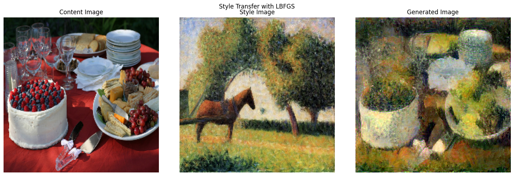

# Neural Style Transfer

This repository contains a PyTorch implementation of the Neural Style Transfer (NST) algorithm, as famously introduced by Leon A. Gatys, Alexander S. Ecker, and Matthias Bethge in their paper, ["A Neural Algorithm of Artistic Style"](https://arxiv.org/abs/1508.06576).

The project demonstrates how to take a **content** image and a **style** image to create a new, synthesized image that retains the content of the former while adopting the artistic style of the latter. This implementation was developed as part of the Computer Vision course at IIITH. This README is partially LLM generated. 

## Example: Picnic + horse-cart

## Methodology

Neural Style Transfer frames the problem as an optimization task. We start with an initial image (either random noise or a copy of the content image) and iteratively modify its pixels to minimize a composite loss function. This process does not train the network; instead, it uses a pre-trained network as a sophisticated feature extractor to define the loss.

### 1. The VGG19 Backbone

The **VGG19** network, pre-trained on the ImageNet dataset, is used as a fixed feature extractor. The key insight is that different layers of a Convolutional Neural Network (CNN) capture different levels of information:
- **Shallow layers** tend to capture low-level features like textures, colors, and brushstrokes (i.e., **style**).
- **Deep layers** capture high-level object arrangements and shapes (i.e., **content**).

### 2. The Loss Function

The total loss is a weighted sum of two individual loss components: a content loss and a style loss.

Total Loss = $\alpha$ * Content Loss + $\beta$ * Style Loss

- $\alpha$ (alpha) is the weight for the content loss.
- $\beta$ (beta) is the weight for the style loss.
- The ratio of $\beta / \alpha$ determines the trade-off between content preservation and style infusion.

#### Content Loss

The content loss measures how different the high-level feature representations are between the content image (`C`) and the generated image (`G`). It is calculated as the Mean Squared Error (MSE) between the feature maps from a single, deep convolutional layer (e.g., `conv4_2` in VGG19).

`L_content = ||F^G - F^C||²`

Where `F^G` and `F^C` are the feature maps of the generated and content images at a specific layer.

#### Style Loss

The style loss is more complex. It aims to match the textural information between the style image (`S`) and the generated image (`G`). This is achieved by using the **Gram Matrix**.

The Gram Matrix of a set of feature maps represents the correlations between different filter responses. It effectively captures the "style" by measuring which features tend to co-occur.

1.  For a given layer, the feature map `F` (with shape C x H x W) is reshaped into a matrix of size C x (H * W).
2.  The Gram matrix `G` is calculated as `G = F * F^T`.
3.  The style loss for that layer is the MSE between the Gram matrices of the generated image and the style image.
4.  The total style loss is the weighted sum of the style losses from multiple layers (typically the first 5 convolutional layers), allowing us to capture style at different scales.

### 3. The Optimization Process

With the VGG19 model's weights frozen, we define the generated image's pixels as trainable parameters. The optimizer's goal is to update these pixels to minimize the total loss.

#### L-BFGS vs. Adam

This project explores two different optimizers:

-   **L-BFGS**: As recommended in the original paper, L-BFGS is a quasi-Newton method that often converges in fewer iterations and produces visually smoother and higher-quality results. Its main drawback is that it's computationally more expensive per step and requires a special `closure()` function in PyTorch to re-evaluate the model and loss multiple times per optimization step.
-   **Adam**: A much more common first-order optimizer. It is significantly faster than L-BFGS but can sometimes produce noisier results.

The comparison below shows the generated outputs from both optimizers. L-BFGS yields a cleaner, more coherent style application, while Adam's result is noisier but was generated much faster.

